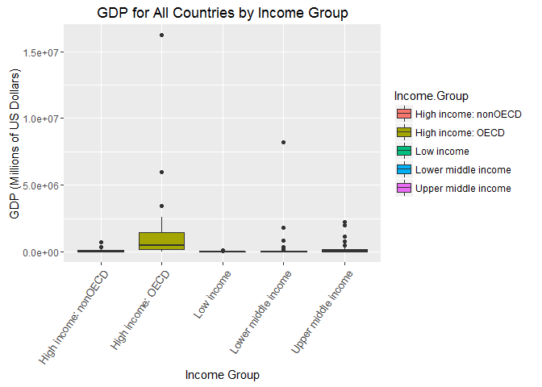
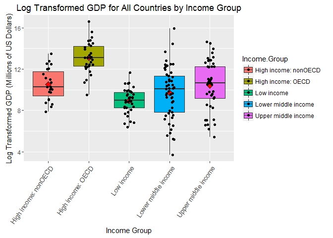

# CBoomhower_CaseStudyUnit6
Chris Boomhower  
June 17, 2016  


```r
##############################
## Chris Boomhower
## MSDS 6306
## Unit 6 Case Study
## 06/11/2016
##############################

## Load required packages
# require(downloader)
#require(tidyr)

## Verify current working directory
# getwd()
# setwd("Analysis//Data")
# getwd()

## Download data
prodURL <- "https://d396qusza40orc.cloudfront.net/getdata%2Fdata%2FGDP.csv"

download(prodURL, destfile = "GrossDomesticProduct.csv")

list.files() # Confirm download to working directory
```

```
## [1] "CBoomhower_CaseStudyUnit6.html"  "CBoomhower_CaseStudyUnit6.md"   
## [3] "CBoomhower_CaseStudyUnit6.Rmd"   "CBoomhower_CaseStudyUnit6_files"
## [5] "Education.csv"                   "GrossDomesticProduct.csv"
```

```r
#product <- read.csv("GrossDomesticProduct.csv")
#education <- read.csv("Education.csv")
#str(product)
#str(education)

## Import Gross Domestic Product data and review raw
productRaw <- read.csv("GrossDomesticProduct.csv", stringsAsFactors = FALSE, header = FALSE) # Try reading characters in as strings instead of factors for easier manipulation
str(productRaw) # Review raw data internal structure details
```

```
## 'data.frame':	331 obs. of  10 variables:
##  $ V1 : chr  "" "" "" "" ...
##  $ V2 : chr  "Gross domestic product 2012" "" "" "Ranking" ...
##  $ V3 : logi  NA NA NA NA NA NA ...
##  $ V4 : chr  "" "" "" "Economy" ...
##  $ V5 : chr  "" "" "(millions of" "US dollars)" ...
##  $ V6 : chr  "" "" "" "" ...
##  $ V7 : logi  NA NA NA NA NA NA ...
##  $ V8 : logi  NA NA NA NA NA NA ...
##  $ V9 : logi  NA NA NA NA NA NA ...
##  $ V10: logi  NA NA NA NA NA NA ...
```

```r
head(productRaw) # Review beginning rows to ensure no blank observations
```

```
##    V1                          V2 V3            V4           V5 V6 V7 V8
## 1     Gross domestic product 2012 NA                               NA NA
## 2                                 NA                               NA NA
## 3                                 NA               (millions of    NA NA
## 4                         Ranking NA       Economy  US dollars)    NA NA
## 5                                 NA                               NA NA
## 6 USA                           1 NA United States  16,244,600     NA NA
##   V9 V10
## 1 NA  NA
## 2 NA  NA
## 3 NA  NA
## 4 NA  NA
## 5 NA  NA
## 6 NA  NA
```

```r
tail(productRaw, 100) # Review ending rows to ensure no blank observations
```

```
##      V1
## 232 MNA
## 233 SAS
## 234 SSA
## 235 HIC
## 236 EMU
## 237    
## 238    
## 239    
## 240    
## 241    
## 242    
## 243    
## 244    
## 245    
## 246    
## 247    
## 248    
## 249    
## 250    
## 251    
## 252    
## 253    
## 254    
## 255    
## 256    
## 257    
## 258    
## 259    
## 260    
## 261    
## 262    
## 263    
## 264    
## 265    
## 266    
## 267    
## 268    
## 269    
## 270    
## 271    
## 272    
## 273    
## 274    
## 275    
## 276    
## 277    
## 278    
## 279    
## 280    
## 281    
## 282    
## 283    
## 284    
## 285    
## 286    
## 287    
## 288    
## 289    
## 290    
## 291    
## 292    
## 293    
## 294    
## 295    
## 296    
## 297    
## 298    
## 299    
## 300    
## 301    
## 302    
## 303    
## 304    
## 305    
## 306    
## 307    
## 308    
## 309    
## 310    
## 311    
## 312    
## 313    
## 314    
## 315    
## 316    
## 317    
## 318    
## 319    
## 320    
## 321    
## 322    
## 323    
## 324    
## 325    
## 326    
## 327    
## 328    
## 329    
## 330    
## 331    
##                                                                                                                               V2
## 232                                                                                                                             
## 233                                                                                                                             
## 234                                                                                                                             
## 235                                                                                                                             
## 236                                                                                                                             
## 237                                                                                                                             
## 238                                                                                                          .. Not available.  
## 239           Note: Rankings include only those economies with confirmed GDP estimates. Figures in italics are for 2011 or 2010.
## 240     a. Includes Former Spanish Sahara.  b. Excludes South Sudan  c. Covers mainland Tanzania only. d. Data are for the area 
## 241 controlled by the government of the Republic of Cyprus.   e. Excludes Abkhazia and South Ossetia.  f. Excludes Transnistria.
## 242                                                                                                                             
## 243                                                                                                                             
## 244                                                                                                                             
## 245                                                                                                                             
## 246                                                                                                                             
## 247                                                                                                                             
## 248                                                                                                                             
## 249                                                                                                                             
## 250                                                                                                                             
## 251                                                                                                                             
## 252                                                                                                                             
## 253                                                                                                                             
## 254                                                                                                                             
## 255                                                                                                                             
## 256                                                                                                                             
## 257                                                                                                                             
## 258                                                                                                                             
## 259                                                                                                                             
## 260                                                                                                                             
## 261                                                                                                                             
## 262                                                                                                                             
## 263                                                                                                                             
## 264                                                                                                                             
## 265                                                                                                                             
## 266                                                                                                                             
## 267                                                                                                                             
## 268                                                                                                                             
## 269                                                                                                                             
## 270                                                                                                                             
## 271                                                                                                                             
## 272                                                                                                                             
## 273                                                                                                                             
## 274                                                                                                                             
## 275                                                                                                                             
## 276                                                                                                                             
## 277                                                                                                                             
## 278                                                                                                                             
## 279                                                                                                                             
## 280                                                                                                                             
## 281                                                                                                                             
## 282                                                                                                                             
## 283                                                                                                                             
## 284                                                                                                                             
## 285                                                                                                                             
## 286                                                                                                                             
## 287                                                                                                                             
## 288                                                                                                                             
## 289                                                                                                                             
## 290                                                                                                                             
## 291                                                                                                                             
## 292                                                                                                                             
## 293                                                                                                                             
## 294                                                                                                                             
## 295                                                                                                                             
## 296                                                                                                                             
## 297                                                                                                                             
## 298                                                                                                                             
## 299                                                                                                                             
## 300                                                                                                                             
## 301                                                                                                                             
## 302                                                                                                                             
## 303                                                                                                                             
## 304                                                                                                                             
## 305                                                                                                                             
## 306                                                                                                                             
## 307                                                                                                                             
## 308                                                                                                                             
## 309                                                                                                                             
## 310                                                                                                                             
## 311                                                                                                                             
## 312                                                                                                                             
## 313                                                                                                                             
## 314                                                                                                                             
## 315                                                                                                                             
## 316                                                                                                                             
## 317                                                                                                                             
## 318                                                                                                                             
## 319                                                                                                                             
## 320                                                                                                                             
## 321                                                                                                                             
## 322                                                                                                                             
## 323                                                                                                                             
## 324                                                                                                                             
## 325                                                                                                                             
## 326                                                                                                                             
## 327                                                                                                                             
## 328                                                                                                                             
## 329                                                                                                                             
## 330                                                                                                                             
## 331                                                                                                                             
##     V3                           V4         V5 V6 V7 V8 V9 V10
## 232 NA   Middle East & North Africa  1,540,807    NA NA NA  NA
## 233 NA                   South Asia  2,286,093    NA NA NA  NA
## 234 NA           Sub-Saharan Africa  1,289,813    NA NA NA  NA
## 235 NA                  High income 49,717,634    NA NA NA  NA
## 236 NA                    Euro area 12,192,344    NA NA NA  NA
## 237 NA                                            NA NA NA  NA
## 238 NA                                            NA NA NA  NA
## 239 NA                                            NA NA NA  NA
## 240 NA                                            NA NA NA  NA
## 241 NA                                            NA NA NA  NA
## 242 NA                                            NA NA NA  NA
## 243 NA                                            NA NA NA  NA
## 244 NA                                            NA NA NA  NA
## 245 NA                                            NA NA NA  NA
## 246 NA                                            NA NA NA  NA
## 247 NA                                            NA NA NA  NA
## 248 NA                                            NA NA NA  NA
## 249 NA                                            NA NA NA  NA
## 250 NA                                            NA NA NA  NA
## 251 NA                                            NA NA NA  NA
## 252 NA                                            NA NA NA  NA
## 253 NA                                            NA NA NA  NA
## 254 NA                                            NA NA NA  NA
## 255 NA                                            NA NA NA  NA
## 256 NA                                            NA NA NA  NA
## 257 NA                                            NA NA NA  NA
## 258 NA                                            NA NA NA  NA
## 259 NA                                            NA NA NA  NA
## 260 NA                                            NA NA NA  NA
## 261 NA                                            NA NA NA  NA
## 262 NA                                            NA NA NA  NA
## 263 NA                                            NA NA NA  NA
## 264 NA                                            NA NA NA  NA
## 265 NA                                            NA NA NA  NA
## 266 NA                                            NA NA NA  NA
## 267 NA                                            NA NA NA  NA
## 268 NA                                            NA NA NA  NA
## 269 NA                                            NA NA NA  NA
## 270 NA                                            NA NA NA  NA
## 271 NA                                            NA NA NA  NA
## 272 NA                                            NA NA NA  NA
## 273 NA                                            NA NA NA  NA
## 274 NA                                            NA NA NA  NA
## 275 NA                                            NA NA NA  NA
## 276 NA                                            NA NA NA  NA
## 277 NA                                            NA NA NA  NA
## 278 NA                                            NA NA NA  NA
## 279 NA                                            NA NA NA  NA
## 280 NA                                            NA NA NA  NA
## 281 NA                                            NA NA NA  NA
## 282 NA                                            NA NA NA  NA
## 283 NA                                            NA NA NA  NA
## 284 NA                                            NA NA NA  NA
## 285 NA                                            NA NA NA  NA
## 286 NA                                            NA NA NA  NA
## 287 NA                                            NA NA NA  NA
## 288 NA                                            NA NA NA  NA
## 289 NA                                            NA NA NA  NA
## 290 NA                                            NA NA NA  NA
## 291 NA                                            NA NA NA  NA
## 292 NA                                            NA NA NA  NA
## 293 NA                                            NA NA NA  NA
## 294 NA                                            NA NA NA  NA
## 295 NA                                            NA NA NA  NA
## 296 NA                                            NA NA NA  NA
## 297 NA                                            NA NA NA  NA
## 298 NA                                            NA NA NA  NA
## 299 NA                                            NA NA NA  NA
## 300 NA                                            NA NA NA  NA
## 301 NA                                            NA NA NA  NA
## 302 NA                                            NA NA NA  NA
## 303 NA                                            NA NA NA  NA
## 304 NA                                            NA NA NA  NA
## 305 NA                                            NA NA NA  NA
## 306 NA                                            NA NA NA  NA
## 307 NA                                            NA NA NA  NA
## 308 NA                                            NA NA NA  NA
## 309 NA                                            NA NA NA  NA
## 310 NA                                            NA NA NA  NA
## 311 NA                                            NA NA NA  NA
## 312 NA                                            NA NA NA  NA
## 313 NA                                            NA NA NA  NA
## 314 NA                                            NA NA NA  NA
## 315 NA                                            NA NA NA  NA
## 316 NA                                            NA NA NA  NA
## 317 NA                                            NA NA NA  NA
## 318 NA                                            NA NA NA  NA
## 319 NA                                            NA NA NA  NA
## 320 NA                                            NA NA NA  NA
## 321 NA                                            NA NA NA  NA
## 322 NA                                            NA NA NA  NA
## 323 NA                                            NA NA NA  NA
## 324 NA                                            NA NA NA  NA
## 325 NA                                            NA NA NA  NA
## 326 NA                                            NA NA NA  NA
## 327 NA                                            NA NA NA  NA
## 328 NA                                            NA NA NA  NA
## 329 NA                                            NA NA NA  NA
## 330 NA                                            NA NA NA  NA
## 331 NA                                            NA NA NA  NA
```

```r
product <- productRaw[6:236,] # Remove empty rows at beginning and end of productRaw data.frame
str(product) # Review raw data internal structure details once more
```

```
## 'data.frame':	231 obs. of  10 variables:
##  $ V1 : chr  "USA" "CHN" "JPN" "DEU" ...
##  $ V2 : chr  "1" "2" "3" "4" ...
##  $ V3 : logi  NA NA NA NA NA NA ...
##  $ V4 : chr  "United States" "China" "Japan" "Germany" ...
##  $ V5 : chr  " 16,244,600 " " 8,227,103 " " 5,959,718 " " 3,428,131 " ...
##  $ V6 : chr  "" "" "" "" ...
##  $ V7 : logi  NA NA NA NA NA NA ...
##  $ V8 : logi  NA NA NA NA NA NA ...
##  $ V9 : logi  NA NA NA NA NA NA ...
##  $ V10: logi  NA NA NA NA NA NA ...
```

```r
head(product) # Review beginning rows once more
```

```
##     V1 V2 V3             V4           V5 V6 V7 V8 V9 V10
## 6  USA  1 NA  United States  16,244,600     NA NA NA  NA
## 7  CHN  2 NA          China   8,227,103     NA NA NA  NA
## 8  JPN  3 NA          Japan   5,959,718     NA NA NA  NA
## 9  DEU  4 NA        Germany   3,428,131     NA NA NA  NA
## 10 FRA  5 NA         France   2,612,878     NA NA NA  NA
## 11 GBR  6 NA United Kingdom   2,471,784     NA NA NA  NA
```

```r
tail(product) # Review ending rows once more
```

```
##      V1 V2 V3                           V4         V5 V6 V7 V8 V9 V10
## 231 LAC    NA    Latin America & Caribbean  5,344,028    NA NA NA  NA
## 232 MNA    NA   Middle East & North Africa  1,540,807    NA NA NA  NA
## 233 SAS    NA                   South Asia  2,286,093    NA NA NA  NA
## 234 SSA    NA           Sub-Saharan Africa  1,289,813    NA NA NA  NA
## 235 HIC    NA                  High income 49,717,634    NA NA NA  NA
## 236 EMU    NA                    Euro area 12,192,344    NA NA NA  NA
```

```r
## Check NAs in imported columns to identify empty columns
sum(!is.na(product[,c(3,7:10)])) # Detect total number of valid entries
```

```
## [1] 0
```

```r
# paste("Column 3 NAs =", sum(is.na(product$V3))) # Output NA counts for empty columns
# paste("Column 7 NAs =", sum(is.na(product$V7)))
# paste("Column 8 NAs =", sum(is.na(product$V8)))
# paste("Column 9 NAs =", sum(is.na(product$V9)))
# paste("Column 10 NAs =", sum(is.na(product$V10)))

## Check character column suspected of having empty character entries
sum(product$V6 != "") # Check character type column for valid entries
```

```
## [1] 6
```

```r
sum(product$V6 == "") # Output empty entry counts
```

```
## [1] 225
```

```r
## Extract only valid columns from raw data
product <- product[,c(1,2,4:6)]

## Provide names for each column
names(product) <- c("Country.Code","Country.Rank", "Economy", "GDP.Millions.of.US.Dollars", "Comments")
names(product) # Ensure names added correctly
```

```
## [1] "Country.Code"               "Country.Rank"              
## [3] "Economy"                    "GDP.Millions.of.US.Dollars"
## [5] "Comments"
```

```r
## Replace comment reference with comment from original data's legend
product[product$Comments != "",] # View valid comment column entries before edits
```

```
##     Country.Code Country.Rank  Economy GDP.Millions.of.US.Dollars Comments
## 67           MAR           62  Morocco                    95,982         a
## 78           SDN           73    Sudan                    58,769         b
## 100          TZA           95 Tanzania                    28,242         c
## 107          CYP          102   Cyprus                    22,767         d
## 119          GEO          114  Georgia                    15,747         e
## 146          MDA          141  Moldova                     7,253         f
```

```r
product$Comments[product$Comments == 'a'] <- "Includes Former Spanish Sahara"
product$Comments[product$Comments == 'b'] <- "Excludes South Sudan"
product$Comments[product$Comments == 'c'] <- "Covers mainland Tanzania only"
product$Comments[product$Comments == 'd'] <- "Data are for the area controlled by the government of the Republic of Cyprus"
product$Comments[product$Comments == 'e'] <- "Excludes Abkhazia and South Ossetia"
product$Comments[product$Comments == 'f'] <- "Excludes Transnistria"
product[product$Comments != "",] # View valid comment column entries after edits
```

```
##     Country.Code Country.Rank  Economy GDP.Millions.of.US.Dollars
## 67           MAR           62  Morocco                    95,982 
## 78           SDN           73    Sudan                    58,769 
## 100          TZA           95 Tanzania                    28,242 
## 107          CYP          102   Cyprus                    22,767 
## 119          GEO          114  Georgia                    15,747 
## 146          MDA          141  Moldova                     7,253 
##                                                                         Comments
## 67                                                Includes Former Spanish Sahara
## 78                                                          Excludes South Sudan
## 100                                                Covers mainland Tanzania only
## 107 Data are for the area controlled by the government of the Republic of Cyprus
## 119                                          Excludes Abkhazia and South Ossetia
## 146                                                        Excludes Transnistria
```

```r
## Convert GDP type to numeric
product$GDP.Millions.of.US.Dollars <- gsub(",","", product$GDP.Millions.of.US.Dollars, fixed = TRUE) # Prep GDP column for
product$GDP.Millions.of.US.Dollars <- gsub(".","", product$GDP.Millions.of.US.Dollars, fixed = TRUE) # type conversion
product$GDP.Millions.of.US.Dollars <- as.numeric(product$GDP.Millions.of.US.Dollars) # Convert GDP type to numeric

## Convert Country.Rank type to integer
product$Country.Rank <- as.integer(product$Country.Rank)

## Output number of NA or empty values for each variable used in analysis
# sum(product$Country.Code == "")
# sum(is.na(product$Country.Rank))
# sum(product$Economy == "")
# sum(is.na(product$GDP.Millions.of.US.Dollars))
# sum(product$Comments == "")

product[!complete.cases(product),] # View all rows for which not all variable data is available
```

```
##     Country.Code Country.Rank                      Economy
## 196                        NA                             
## 197          ASM           NA               American Samoa
## 198          ADO           NA                      Andorra
## 199          CYM           NA               Cayman Islands
## 200          CHI           NA              Channel Islands
## 201          CUW           NA                      Curaçao
## 202          DJI           NA                     Djibouti
## 203          FRO           NA               Faeroe Islands
## 204          PYF           NA             French Polynesia
## 205          GRL           NA                    Greenland
## 206          GUM           NA                         Guam
## 207          IMY           NA                  Isle of Man
## 208          PRK           NA             Korea, Dem. Rep.
## 209          LBY           NA                        Libya
## 210          LIE           NA                Liechtenstein
## 211          MMR           NA                      Myanmar
## 212          NCL           NA                New Caledonia
## 213          MNP           NA     Northern Mariana Islands
## 214          SMR           NA                   San Marino
## 215          SXM           NA    Sint Maarten (Dutch part)
## 216          SOM           NA                      Somalia
## 217          MAF           NA     St. Martin (French part)
## 218          TCA           NA     Turks and Caicos Islands
## 219          VIR           NA        Virgin Islands (U.S.)
## 220          WBG           NA           West Bank and Gaza
## 221                        NA                             
## 222          WLD           NA                        World
## 223                        NA                             
## 224          LIC           NA                   Low income
## 225          MIC           NA                Middle income
## 226          LMC           NA          Lower middle income
## 227          UMC           NA          Upper middle income
## 228          LMY           NA          Low & middle income
## 229          EAP           NA          East Asia & Pacific
## 230          ECA           NA        Europe & Central Asia
## 231          LAC           NA    Latin America & Caribbean
## 232          MNA           NA   Middle East & North Africa
## 233          SAS           NA                   South Asia
## 234          SSA           NA           Sub-Saharan Africa
## 235          HIC           NA                  High income
## 236          EMU           NA                    Euro area
##     GDP.Millions.of.US.Dollars Comments
## 196                         NA         
## 197                         NA         
## 198                         NA         
## 199                         NA         
## 200                         NA         
## 201                         NA         
## 202                         NA         
## 203                         NA         
## 204                         NA         
## 205                         NA         
## 206                         NA         
## 207                         NA         
## 208                         NA         
## 209                         NA         
## 210                         NA         
## 211                         NA         
## 212                         NA         
## 213                         NA         
## 214                         NA         
## 215                         NA         
## 216                         NA         
## 217                         NA         
## 218                         NA         
## 219                         NA         
## 220                         NA         
## 221                         NA         
## 222                   72440449         
## 223                         NA         
## 224                     504431         
## 225                   22249909         
## 226                    4823811         
## 227                   17426690         
## 228                   22769282         
## 229                   10329684         
## 230                    1887950         
## 231                    5344028         
## 232                    1540807         
## 233                    2286093         
## 234                    1289813         
## 235                   49717634         
## 236                   12192344
```

```r
## Remove missing Country.Code values from the data frame
# product <- product[complete.cases(product),]
# str(product)
product1 <- subset(product, product$Country.Code != "")
# product1 <- subset(product1, !is.na(product1$GDP.Millions.of.US.Dollars))

## Extract only Country.Code and GDP column data to be merged
GDPdata <- product1[,c(1,2,4)]
str(GDPdata) # Review extracted data internal structure details
```

```
## 'data.frame':	228 obs. of  3 variables:
##  $ Country.Code              : chr  "USA" "CHN" "JPN" "DEU" ...
##  $ Country.Rank              : int  1 2 3 4 5 6 7 8 9 10 ...
##  $ GDP.Millions.of.US.Dollars: num  16244600 8227103 5959718 3428131 2612878 ...
```

```r
nrow(GDPdata[!complete.cases(GDPdata$Country.Code),]) # Confirm there are no missing Country.Code values in the data
```

```
## [1] 0
```

```r
GDPdata <- GDPdata[order(GDPdata$Country.Code),] # Order the data by Country.Code instead of GDP

# write.csv(GDPdata, "Product_clean.csv", row.names = FALSE)
```


```r
##############################
## Chris Boomhower
## MSDS 6306
## Unit 6 Case Study
## 06/11/2016
##############################

## Load required packages
# require(downloader)
# require(ggplot2)
# require(tidyr)
# require(dplyr)

## Verify current working directory
# getwd()
# setwd("Analysis//Data")
# getwd()

## Download data
educURL <- "https://d396qusza40orc.cloudfront.net/getdata%2Fdata%2FEDSTATS_Country.csv"
download(educURL, destfile = "Education.csv")

list.files() # Confirm download to working directory
```

```
## [1] "CBoomhower_CaseStudyUnit6.html"  "CBoomhower_CaseStudyUnit6.md"   
## [3] "CBoomhower_CaseStudyUnit6.Rmd"   "CBoomhower_CaseStudyUnit6_files"
## [5] "Education.csv"                   "GrossDomesticProduct.csv"
```

```r
## Import Educational data and review raw data
EducRaw <- read.csv("Education.csv", stringsAsFactors = FALSE, header = TRUE) # Try reading characters in as strings instead of factors for easier manipulation
str(EducRaw) # Review raw data internal structure details
```

```
## 'data.frame':	234 obs. of  31 variables:
##  $ CountryCode                                      : chr  "ABW" "ADO" "AFG" "AGO" ...
##  $ Long.Name                                        : chr  "Aruba" "Principality of Andorra" "Islamic State of Afghanistan" "People's Republic of Angola" ...
##  $ Income.Group                                     : chr  "High income: nonOECD" "High income: nonOECD" "Low income" "Lower middle income" ...
##  $ Region                                           : chr  "Latin America & Caribbean" "Europe & Central Asia" "South Asia" "Sub-Saharan Africa" ...
##  $ Lending.category                                 : chr  "" "" "IDA" "IDA" ...
##  $ Other.groups                                     : chr  "" "" "HIPC" "" ...
##  $ Currency.Unit                                    : chr  "Aruban florin" "Euro" "Afghan afghani" "Angolan kwanza" ...
##  $ Latest.population.census                         : chr  "2000" "Register based" "1979" "1970" ...
##  $ Latest.household.survey                          : chr  "" "" "MICS, 2003" "MICS, 2001, MIS, 2006/07" ...
##  $ Special.Notes                                    : chr  "" "" "Fiscal year end: March 20; reporting period for national accounts data: FY." "" ...
##  $ National.accounts.base.year                      : chr  "1995" "" "2002/2003" "1997" ...
##  $ National.accounts.reference.year                 : int  NA NA NA NA 1996 NA NA 1996 NA NA ...
##  $ System.of.National.Accounts                      : int  NA NA NA NA 1993 NA 1993 1993 NA NA ...
##  $ SNA.price.valuation                              : chr  "" "" "VAB" "VAP" ...
##  $ Alternative.conversion.factor                    : chr  "" "" "" "1991-96" ...
##  $ PPP.survey.year                                  : int  NA NA NA 2005 2005 NA 2005 2005 NA NA ...
##  $ Balance.of.Payments.Manual.in.use                : chr  "" "" "" "BPM5" ...
##  $ External.debt.Reporting.status                   : chr  "" "" "Actual" "Actual" ...
##  $ System.of.trade                                  : chr  "Special" "General" "General" "Special" ...
##  $ Government.Accounting.concept                    : chr  "" "" "Consolidated" "" ...
##  $ IMF.data.dissemination.standard                  : chr  "" "" "GDDS" "GDDS" ...
##  $ Source.of.most.recent.Income.and.expenditure.data: chr  "" "" "" "IHS, 2000" ...
##  $ Vital.registration.complete                      : chr  "" "Yes" "" "" ...
##  $ Latest.agricultural.census                       : chr  "" "" "" "1964-65" ...
##  $ Latest.industrial.data                           : int  NA NA NA NA 2005 NA 2001 NA NA NA ...
##  $ Latest.trade.data                                : int  2008 2006 2008 1991 2008 2008 2008 2008 NA 2007 ...
##  $ Latest.water.withdrawal.data                     : int  NA NA 2000 2000 2000 2005 2000 2000 NA 1990 ...
##  $ X2.alpha.code                                    : chr  "AW" "AD" "AF" "AO" ...
##  $ WB.2.code                                        : chr  "AW" "AD" "AF" "AO" ...
##  $ Table.Name                                       : chr  "Aruba" "Andorra" "Afghanistan" "Angola" ...
##  $ Short.Name                                       : chr  "Aruba" "Andorra" "Afghanistan" "Angola" ...
```

```r
head(EducRaw) # Review beginning rows to ensure no blank observations
```

```
##   CountryCode                    Long.Name         Income.Group
## 1         ABW                        Aruba High income: nonOECD
## 2         ADO      Principality of Andorra High income: nonOECD
## 3         AFG Islamic State of Afghanistan           Low income
## 4         AGO  People's Republic of Angola  Lower middle income
## 5         ALB          Republic of Albania  Upper middle income
## 6         ARE         United Arab Emirates High income: nonOECD
##                       Region Lending.category Other.groups  Currency.Unit
## 1  Latin America & Caribbean                                Aruban florin
## 2      Europe & Central Asia                                         Euro
## 3                 South Asia              IDA         HIPC Afghan afghani
## 4         Sub-Saharan Africa              IDA              Angolan kwanza
## 5      Europe & Central Asia             IBRD                Albanian lek
## 6 Middle East & North Africa                                U.A.E. dirham
##   Latest.population.census  Latest.household.survey
## 1                     2000                         
## 2           Register based                         
## 3                     1979               MICS, 2003
## 4                     1970 MICS, 2001, MIS, 2006/07
## 5                     2001               MICS, 2005
## 6                     2005                         
##                                                                 Special.Notes
## 1                                                                            
## 2                                                                            
## 3 Fiscal year end: March 20; reporting period for national accounts data: FY.
## 4                                                                            
## 5                                                                            
## 6                                                                            
##   National.accounts.base.year National.accounts.reference.year
## 1                        1995                               NA
## 2                                                           NA
## 3                   2002/2003                               NA
## 4                        1997                               NA
## 5                                                         1996
## 6                        1995                               NA
##   System.of.National.Accounts SNA.price.valuation
## 1                          NA                    
## 2                          NA                    
## 3                          NA                 VAB
## 4                          NA                 VAP
## 5                        1993                 VAB
## 6                          NA                 VAB
##   Alternative.conversion.factor PPP.survey.year
## 1                                            NA
## 2                                            NA
## 3                                            NA
## 4                       1991-96            2005
## 5                                          2005
## 6                                            NA
##   Balance.of.Payments.Manual.in.use External.debt.Reporting.status
## 1                                                                 
## 2                                                                 
## 3                                                           Actual
## 4                              BPM5                         Actual
## 5                              BPM5                         Actual
## 6                              BPM4                               
##   System.of.trade Government.Accounting.concept
## 1         Special                              
## 2         General                              
## 3         General                  Consolidated
## 4         Special                              
## 5         General                  Consolidated
## 6         General                  Consolidated
##   IMF.data.dissemination.standard
## 1                                
## 2                                
## 3                            GDDS
## 4                            GDDS
## 5                            GDDS
## 6                            GDDS
##   Source.of.most.recent.Income.and.expenditure.data
## 1                                                  
## 2                                                  
## 3                                                  
## 4                                         IHS, 2000
## 5                                        LSMS, 2005
## 6                                                  
##   Vital.registration.complete Latest.agricultural.census
## 1                                                       
## 2                         Yes                           
## 3                                                       
## 4                                                1964-65
## 5                         Yes                       1998
## 6                                                   1998
##   Latest.industrial.data Latest.trade.data Latest.water.withdrawal.data
## 1                     NA              2008                           NA
## 2                     NA              2006                           NA
## 3                     NA              2008                         2000
## 4                     NA              1991                         2000
## 5                   2005              2008                         2000
## 6                     NA              2008                         2005
##   X2.alpha.code WB.2.code           Table.Name           Short.Name
## 1            AW        AW                Aruba                Aruba
## 2            AD        AD              Andorra              Andorra
## 3            AF        AF          Afghanistan          Afghanistan
## 4            AO        AO               Angola               Angola
## 5            AL        AL              Albania              Albania
## 6            AE        AE United Arab Emirates United Arab Emirates
```

```r
tail(EducRaw) # Review ending rows to ensure no blank observations
```

```
##     CountryCode                        Long.Name        Income.Group
## 229         WSM                            Samoa Lower middle income
## 230         YEM                Republic of Yemen Lower middle income
## 231         ZAF         Republic of South Africa Upper middle income
## 232         ZAR Democratic Republic of the Congo          Low income
## 233         ZMB               Republic of Zambia          Low income
## 234         ZWE             Republic of Zimbabwe          Low income
##                         Region Lending.category Other.groups
## 229        East Asia & Pacific              IDA             
## 230 Middle East & North Africa              IDA             
## 231         Sub-Saharan Africa             IBRD             
## 232         Sub-Saharan Africa              IDA         HIPC
## 233         Sub-Saharan Africa              IDA         HIPC
## 234         Sub-Saharan Africa            Blend             
##          Currency.Unit Latest.population.census Latest.household.survey
## 229        Samoan tala                     2006                        
## 230        Yemeni rial                     2004              MICS, 2006
## 231 South African rand                     2001               DHS, 2003
## 232    Congolese franc                     1984                DHS 2007
## 233     Zambian kwacha                     2000               DHS, 2007
## 234    Zimbabwe dollar                     2002            DHS, 2005/06
##                                                                   Special.Notes
## 229                                                                            
## 230                                                                            
## 231 Fiscal year end: March 31; reporting period for national accounts data: CY.
## 232                                                                            
## 233                                                                            
## 234  Fiscal year end: June 30; reporting period for national accounts data: CY.
##     National.accounts.base.year National.accounts.reference.year
## 229                        2002                               NA
## 230                        1990                               NA
## 231                        2000                               NA
## 232                        1987                               NA
## 233                        1994                               NA
## 234                        1990                               NA
##     System.of.National.Accounts SNA.price.valuation
## 229                          NA                 VAB
## 230                          NA                 VAP
## 231                        1993                 VAB
## 232                        1993                 VAB
## 233                          NA                 VAB
## 234                          NA                 VAB
##     Alternative.conversion.factor PPP.survey.year
## 229                                            NA
## 230                       1990-96            2005
## 231                                          2005
## 232                       1999-01            2005
## 233                       1990-92            2005
## 234                    1991, 1998            2005
##     Balance.of.Payments.Manual.in.use External.debt.Reporting.status
## 229                              BPM5                    Preliminary
## 230                              BPM5                         Actual
## 231                              BPM5                    Preliminary
## 232                              BPM5                       Estimate
## 233                              BPM5                    Preliminary
## 234                              BPM5                         Actual
##     System.of.trade Government.Accounting.concept
## 229         General                              
## 230         General                     Budgetary
## 231         General                  Consolidated
## 232         Special                  Consolidated
## 233         General                     Budgetary
## 234         General                  Consolidated
##     IMF.data.dissemination.standard
## 229                                
## 230                            GDDS
## 231                            SDDS
## 232                            GDDS
## 233                            GDDS
## 234                            GDDS
##     Source.of.most.recent.Income.and.expenditure.data
## 229                                                  
## 230                                       ES/BS, 2005
## 231                                       ES/BS, 2000
## 232                                    1-2-3, 2005-06
## 233                                      IHS, 2004-05
## 234                                                  
##     Vital.registration.complete Latest.agricultural.census
## 229                                                   1999
## 230                                                   2002
## 231                                                   2000
## 232                                                   1990
## 233                                                   1990
## 234                                                   1960
##     Latest.industrial.data Latest.trade.data Latest.water.withdrawal.data
## 229                     NA              2008                           NA
## 230                   2005              2008                         2000
## 231                   2005              2008                         2000
## 232                     NA              1986                         2000
## 233                     NA              2008                         2000
## 234                   1995              2008                         2002
##     X2.alpha.code WB.2.code       Table.Name      Short.Name
## 229            WS        WS            Samoa           Samoa
## 230            YE        RY      Yemen, Rep.           Yemen
## 231            ZA        ZA     South Africa    South Africa
## 232            CD        ZR Congo, Dem. Rep. Dem. Rep. Congo
## 233            ZM        ZM           Zambia          Zambia
## 234            ZW        ZW         Zimbabwe        Zimbabwe
```

```r
## Rename CountryCode variable to match GDPdata's Country.Code
Education <- rename(EducRaw, Country.Code = CountryCode)

## Check NAs or missing values in columns of interest
nrow(Education[Education$Country.Code == "",])
```

```
## [1] 0
```

```r
nrow(Education[Education$Income.Group == "",])
```

```
## [1] 24
```

```r
nrow(Education[Education$Short.Name == "",])
```

```
## [1] 0
```

```r
# nrow(EducRaw)

## Remove missing Income.Group values and assign subset to new data frame
# Education <- subset(EducRaw, EducRaw$Income.Group != "")

## Extract CountryCode and Income.Group columns
# Income <- Education[,1:3]
Income <- Education[,c(1,3,31)]
head(Income)
```

```
##   Country.Code         Income.Group           Short.Name
## 1          ABW High income: nonOECD                Aruba
## 2          ADO High income: nonOECD              Andorra
## 3          AFG           Low income          Afghanistan
## 4          AGO  Lower middle income               Angola
## 5          ALB  Upper middle income              Albania
## 6          ARE High income: nonOECD United Arab Emirates
```

```r
nrow(Income[Income$Country.Code == "",]) # Confirm there are no missing Country.Code values in the data
```

```
## [1] 0
```

```r
# write.csv(Income, "Income_clean.csv", row.names = FALSE)
```


```r
##############################
## Chris Boomhower
## MSDS 6306
## Unit 6 Case Study
## 06/11/2016
##############################

## Load required packages
# require(ggplot2)
# require(knitr)

## QUESTION 1: MATCH THE DATA BASED ON THE COUNTRY SHORTCODE. HOW MANY OF THE IDs MATCH?
## Merge Income and GDPdata
MergeData <- merge(Income, GDPdata, by = "Country.Code", all = TRUE)
str(MergeData) # Review raw data internal structure details
```

```
## 'data.frame':	238 obs. of  5 variables:
##  $ Country.Code              : chr  "ABW" "ADO" "AFG" "AGO" ...
##  $ Income.Group              : chr  "High income: nonOECD" "High income: nonOECD" "Low income" "Lower middle income" ...
##  $ Short.Name                : chr  "Aruba" "Andorra" "Afghanistan" "Angola" ...
##  $ Country.Rank              : int  161 NA 105 60 125 32 26 133 NA 172 ...
##  $ GDP.Millions.of.US.Dollars: num  2584 NA 20497 114147 12648 ...
```

```r
head(MergeData) # Review beginning rows to ensure no blank observations
```

```
##   Country.Code         Income.Group           Short.Name Country.Rank
## 1          ABW High income: nonOECD                Aruba          161
## 2          ADO High income: nonOECD              Andorra           NA
## 3          AFG           Low income          Afghanistan          105
## 4          AGO  Lower middle income               Angola           60
## 5          ALB  Upper middle income              Albania          125
## 6          ARE High income: nonOECD United Arab Emirates           32
##   GDP.Millions.of.US.Dollars
## 1                       2584
## 2                         NA
## 3                      20497
## 4                     114147
## 5                      12648
## 6                     348595
```

```r
## Indicate how many of the IDs match
length(intersect(GDPdata$Country.Code, Income$Country.Code))
```

```
## [1] 224
```

```r
## Indicate how many of the rows contain NAs
sum(!complete.cases(MergeData))
```

```
## [1] 49
```

```r
## Remove rows with missing data
MergeData1 <- MergeData[complete.cases(MergeData),]
nrow(MergeData1) # Provide row count after removing rows with missing data
```

```
## [1] 189
```

```r
## QUESTION 2: SORT THE DATA FRAME IN ASCENDING ORDER BY GDP (SO UNITED STATES IS LAST). WHAT IS THE 13TH COUNTRY IN THE RESULTING DATA FRAME?
MergeData1 <- MergeData1[order(MergeData1$GDP.Millions.of.US.Dollars, decreasing = FALSE),] # Sort the data frame by GDP
MergeData1$Short.Name[13] # Display only the 13th country in the data frame
```

```
## [1] "St. Kitts and Nevis"
```

```r
## QUESTION 3: WHAT ARE THE AVERAGE GDP RANKINGS FOR THE "High income: OECD" AND "High income: nonOECD" GROUPS?
mean(subset(MergeData1, Income.Group == "High income: OECD")$Country.Rank)
```

```
## [1] 32.96667
```

```r
mean(subset(MergeData1, Income.Group == "High income: nonOECD")$Country.Rank)
```

```
## [1] 91.91304
```

```r
## QUESTION 4: PLOT THE GDP FOR ALL OF THE COUNTRIES. USE GGPLOT2 TO COLOR YOUR PLOT BY Income.Group
# MergeData1$Country.Code <- as.factor(MergeData1$Country.Code) # Convert Country.Code type to factor in order to reorder ggplot x-axis by Income.Group
# MergeData1$Country.Code <- factor(MergeData1$Country.Code, levels = MergeData1$Country.Code[order(MergeData1$GDP.Millions.of.US.Dollars)]) # Reorder Country.Code by Income.Group

ggplot(data = MergeData1, aes(x=Income.Group, y=GDP.Millions.of.US.Dollars, fill=Income.Group)) +
    geom_boxplot() +                                                                            # Create boxplots
    theme(axis.text.x = element_text(angle = 55, hjust = 1, size = 10)) +                       # Adjust X axis label size and position
    xlab("Income Group") + ylab("GDP (Millions of US Dollars)") + ggtitle("GDP for All Countries by Income Group") # Provide labels
```

<!-- -->

```r
ggplot(data = MergeData1, aes(x=Income.Group, y=log(GDP.Millions.of.US.Dollars), fill=Income.Group)) + # Re-plot log transformed GDP
    geom_boxplot() + stat_summary(fun.y=mean, geom="point", shape=23, size=3, fill="red") +     
    geom_jitter(shape=16, position=position_jitter(0.3)) +                                      # Add individual data points with jitter
    theme(axis.text.x = element_text(angle = 55, hjust = 1, size = 10)) +                       
    xlab("Income Group") + ylab("Log Transformed GDP (Millions of US Dollars)") + ggtitle("Log Transformed GDP for All Countries by Income Group") # Provide labels
```

<!-- -->

```r
## QUESTION 5: CUT THE GDP RANKING INTO 5 SEPARATE QUANTILE GROUPS. MAKE A TABLE VERSUS Income.Group. HOW MANY COUNTRIES ARE
## LOWER MIDDLE INCOME BUT AMONG THE 38 NATIONS WITH THE HIGHEST GDP?

## Create additional data frame and add quantile column
MergeData2 <- MergeData1
MergeData2$GDP.Quantile <- ntile(MergeData2$Country.Rank, 5) # Add 5 quantiles by Country.Rank to new GDP.Quantile column

## Generate table output
kable(MergeData2[,c(2:3,6)], format = "pandoc", caption = "Country GDP Quantiles vs. Country GDP Rank:", align = 'l', row.names = FALSE)
```


Table: Country GDP Quantiles vs. Country GDP Rank:

Income.Group           Short.Name                       GDP.Quantile 
---------------------  -------------------------------  -------------
Lower middle income    Tuvalu                           5            
Lower middle income    Kiribati                         5            
Lower middle income    Marshall Islands                 5            
Upper middle income    Palau                            5            
Lower middle income    São Tomé and Principe            5            
Lower middle income    Micronesia                       5            
Lower middle income    Tonga                            5            
Upper middle income    Dominica                         5            
Low income             Comoros                          5            
Lower middle income    Samoa                            5            
Upper middle income    St. Vincent and the Grenadines   5            
Upper middle income    Grenada                          5            
Upper middle income    St. Kitts and Nevis              5            
Lower middle income    Vanuatu                          5            
Low income             Guinea-Bissau                    5            
Low income             The Gambia                       5            
Low income             Solomon Islands                  5            
Upper middle income    Seychelles                       5            
Upper middle income    Antigua and Barbuda              5            
Upper middle income    St. Lucia                        5            
Lower middle income    Timor-Leste                      5            
Lower middle income    Belize                           5            
Low income             Liberia                          5            
Lower middle income    Bhutan                           5            
Lower middle income    Cape Verde                       5            
Low income             Central African Republic         5            
Lower middle income    Maldives                         5            
Lower middle income    Lesotho                          5            
Low income             Burundi                          5            
High income: nonOECD   Aruba                            5            
Lower middle income    Guyana                           5            
Low income             Eritrea                          5            
Lower middle income    Swaziland                        5            
Low income             Sierra Leone                     5            
Low income             Togo                             5            
Upper middle income    Fiji                             5            
Low income             Mauritania                       5            
High income: nonOECD   Barbados                         4            
Low income             Malawi                           4            
Upper middle income    Montenegro                       4            
Upper middle income    Suriname                         4            
High income: nonOECD   Bermuda                          4            
Low income             Guinea                           4            
High income: nonOECD   Monaco                           4            
Lower middle income    Kosovo                           4            
Low income             Kyrgyz Republic                  4            
Low income             Niger                            4            
Low income             Tajikistan                       4            
Low income             Rwanda                           4            
Lower middle income    Moldova                          4            
Low income             Benin                            4            
Low income             Haiti                            4            
High income: nonOECD   The Bahamas                      4            
High income: nonOECD   Malta                            4            
Low income             Lao PDR                          4            
Upper middle income    Macedonia                        4            
Low income             Zimbabwe                         4            
Lower middle income    Armenia                          4            
Low income             Madagascar                       4            
Lower middle income    Mongolia                         4            
Low income             Mali                             4            
Low income             Burkina Faso                     4            
Upper middle income    Mauritius                        4            
Lower middle income    Nicaragua                        4            
Upper middle income    Albania                          4            
Low income             Chad                             4            
Upper middle income    Namibia                          4            
High income: OECD      Iceland                          4            
Lower middle income    Congo                            4            
Low income             Cambodia                         4            
Lower middle income    Senegal                          4            
Low income             Mozambique                       4            
Upper middle income    Botswana                         4            
Upper middle income    Jamaica                          4            
Lower middle income    Papua New Guinea                 4            
Lower middle income    Georgia                          3            
High income: nonOECD   Brunei                           3            
Low income             Dem. Rep. Congo                  3            
Upper middle income    Bosnia and Herzegovina           3            
High income: nonOECD   Equatorial Guinea                3            
Upper middle income    Gabon                            3            
Lower middle income    Honduras                         3            
Low income             Nepal                            3            
Low income             Uganda                           3            
Low income             Afghanistan                      3            
Low income             Zambia                           3            
High income: nonOECD   Estonia                          3            
High income: nonOECD   Cyprus                           3            
High income: nonOECD   Trinidad and Tobago              3            
Lower middle income    El Salvador                      3            
Lower middle income    Côte d'Ivoire                    3            
Lower middle income    Cameroon                         3            
Lower middle income    Paraguay                         3            
Lower middle income    Bolivia                          3            
Low income             Tanzania                         3            
High income: nonOECD   Latvia                           3            
High income: nonOECD   Bahrain                          3            
Lower middle income    Jordan                           3            
Lower middle income    Turkmenistan                     3            
Lower middle income    Yemen                            3            
Upper middle income    Panama                           3            
Upper middle income    Serbia                           3            
Low income             Kenya                            3            
Low income             Ghana                            3            
Low income             Ethiopia                         3            
Upper middle income    Lithuania                        3            
Upper middle income    Lebanon                          3            
High income: nonOECD   Macao SAR, China                 3            
Upper middle income    Costa Rica                       3            
High income: OECD      Slovenia                         3            
Lower middle income    Tunisia                          3            
Upper middle income    Uruguay                          3            
Lower middle income    Guatemala                        3            
Upper middle income    Bulgaria                         2            
Lower middle income    Uzbekistan                       2            
High income: OECD      Luxembourg                       2            
Lower middle income    Sudan                            2            
Upper middle income    Dominican Republic               2            
High income: nonOECD   Croatia                          2            
Lower middle income    Sri Lanka                        2            
Upper middle income    Belarus                          2            
Upper middle income    Azerbaijan                       2            
Upper middle income    Cuba                             2            
High income: nonOECD   Oman                             2            
Lower middle income    Syrian Arab Republic             2            
Lower middle income    Ecuador                          2            
High income: OECD      Slovak Republic                  2            
Lower middle income    Morocco                          2            
High income: nonOECD   Puerto Rico                      2            
Lower middle income    Angola                           2            
Low income             Bangladesh                       2            
High income: OECD      Hungary                          2            
Lower middle income    Vietnam                          2            
High income: nonOECD   Kuwait                           2            
High income: OECD      New Zealand                      2            
High income: nonOECD   Qatar                            2            
Lower middle income    Ukraine                          2            
Upper middle income    Romania                          2            
High income: OECD      Czech Republic                   2            
Upper middle income    Kazakhstan                       2            
Upper middle income    Peru                             2            
Upper middle income    Algeria                          2            
Lower middle income    Iraq                             2            
High income: OECD      Ireland                          2            
High income: OECD      Portugal                         2            
Lower middle income    Pakistan                         2            
High income: OECD      Finland                          2            
High income: OECD      Greece                           2            
Lower middle income    Philippines                      2            
High income: OECD      Israel                           2            
Lower middle income    Nigeria                          2            
Lower middle income    Egypt                            1            
High income: nonOECD   Hong Kong SAR, China             1            
Upper middle income    Chile                            1            
High income: nonOECD   Singapore                        1            
Upper middle income    Malaysia                         1            
High income: OECD      Denmark                          1            
High income: nonOECD   United Arab Emirates             1            
Lower middle income    Thailand                         1            
Upper middle income    Colombia                         1            
Upper middle income    Venezuela                        1            
Upper middle income    South Africa                     1            
High income: OECD      Austria                          1            
Upper middle income    Argentina                        1            
High income: OECD      Belgium                          1            
High income: OECD      Poland                           1            
High income: OECD      Norway                           1            
Upper middle income    Iran                             1            
High income: OECD      Sweden                           1            
High income: OECD      Switzerland                      1            
High income: nonOECD   Saudi Arabia                     1            
High income: OECD      Netherlands                      1            
Upper middle income    Turkey                           1            
Lower middle income    Indonesia                        1            
High income: OECD      Korea                            1            
Upper middle income    Mexico                           1            
High income: OECD      Spain                            1            
High income: OECD      Australia                        1            
High income: OECD      Canada                           1            
Lower middle income    India                            1            
High income: OECD      Italy                            1            
Upper middle income    Russia                           1            
Upper middle income    Brazil                           1            
High income: OECD      United Kingdom                   1            
High income: OECD      France                           1            
High income: OECD      Germany                          1            
High income: OECD      Japan                            1            
Lower middle income    China                            1            
High income: OECD      United States                    1            

```r
## Count number of lower middle income countries
sum(MergeData2[(nrow(MergeData2)-37):nrow(MergeData2),]$Income.Group == "Lower middle income")
```

```
## [1] 5
```
